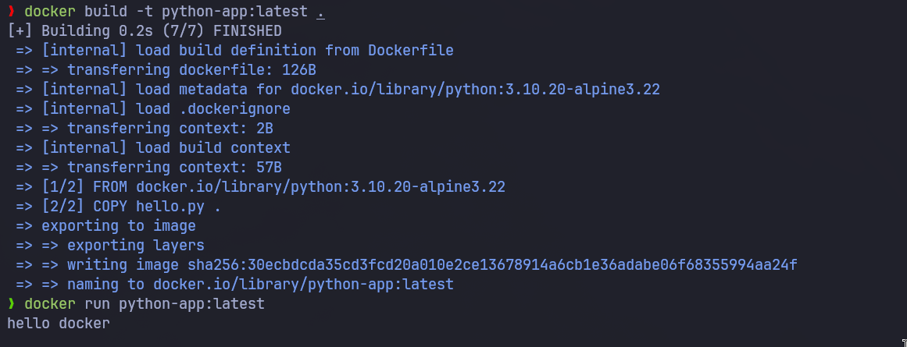

# Docker Lab-01

## Problem 01

- run hello world container
  

- check container status
  

- start container
  

- delete the container and the image
  

## Problem 02

- run ubuntu container
  

- echo docker and create hello docker file
  

- removing the container will delete all its files including hello-docker
  

## Problem 03

- deploy mysql


## Problem 04

- run nginx
  

- add html static


- now nginx serve my app
  

- commit the container to create a new image from it and push the new image to dockerhub
  

## Problem 05

```Docker
FROM python:3.10.20-alpine3.22

COPY hello.py .

CMD ["python", "hello.py"]
```

- build the container and run
  

- rename the image and push it
  
