# Docker Labs

<!--toc:start-->

- [Docker Labs](#docker-labs)
  - [Lab 01](#lab-01)
    - [Problem 01](#lab-01-problem-01)
    - [Problem 02](#lab-01-problem-02)
    - [Problem 03](#lab-01-problem-03)
    - [Problem 04](#lab-01-problem-04)
    - [Problem 05](#lab-01-problem-05)
  - [Lab 02](#lab-02)
    - [Problem 01](#lab-02-problem-01)
    - [Problem 02](#lab-02-problem-02)
    <!--toc:end-->

## Lab 01

<a id="lab-01"></a>
<a id="lab-01-problem-01"></a>

### Problem 01

- run hello world container  
  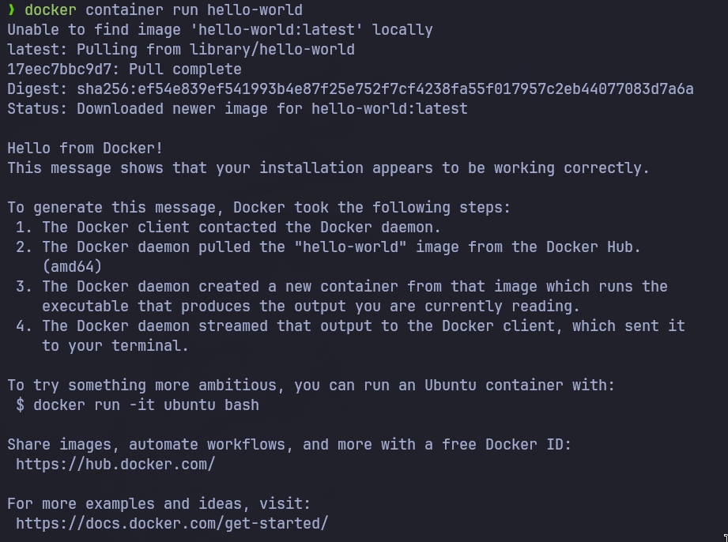

- check container status  
  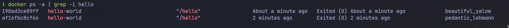

- start container  
  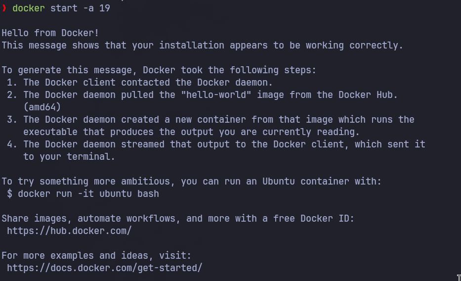

- delete the container and the image  
  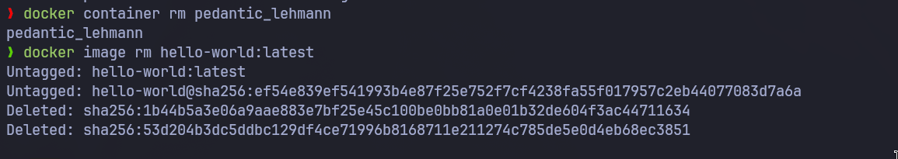

<a id="lab-01-problem-02"></a>

### Problem 02

- run ubuntu container  
  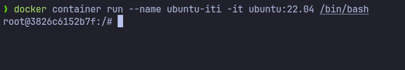

- echo docker and create hello docker file  
  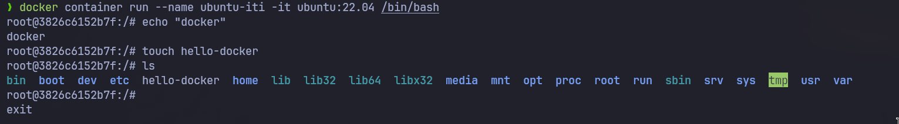

- removing the container will delete all its files including hello-docker  
  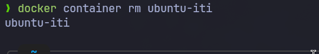

<a id="lab-01-problem-03"></a>

### Problem 03

- deploy mysql

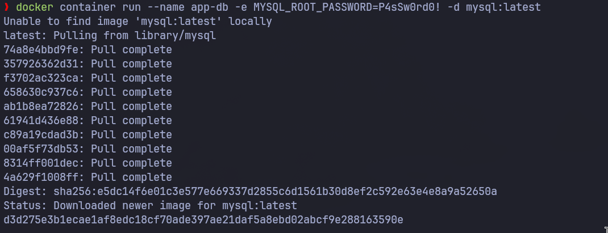

<a id="lab-01-problem-04"></a>

### Problem 04

- run nginx  
  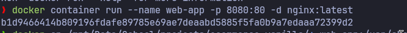

- add html static

  

- now nginx serve my app  
  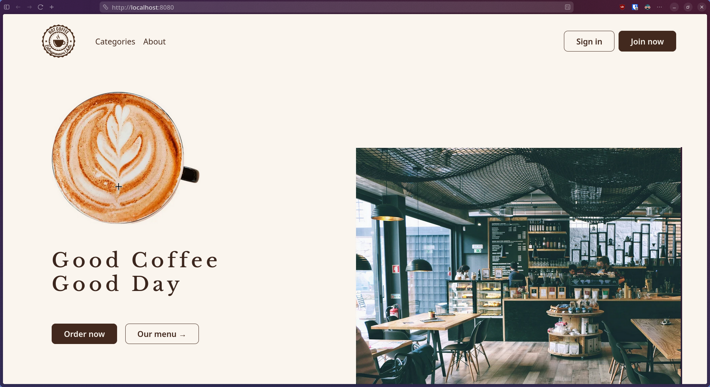

- commit the container to create a new image from it and push the new image to dockerhub  
  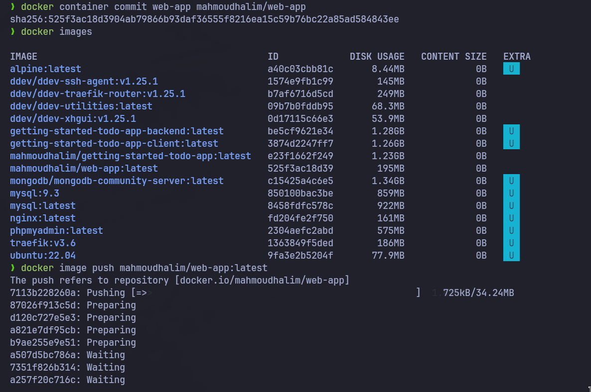

<a id="lab-01-problem-05"></a>

### Problem 05

- Single stage

```Dockerfile
FROM python:3.10.20
WORKDIR /app
COPY requirements.txt .
RUN pip install --user --no-cache-dir -r requirements.txt
COPY hello.py .
EXPOSE 5000
CMD ["python", "hello.py"]
```

- multistage

```Dockerfile
FROM python:3.10.20 AS builder
WORKDIR /build
COPY requirements.txt .
RUN pip install --user --no-cache-dir -r requirements.txt

FROM python:3.10.20-slim
WORKDIR /app

COPY --from=builder /root/.local /root/.local
COPY hello.py .

ENV PATH=/root/.local/bin:$PATH

EXPOSE 5000
CMD ["python", "hello.py"]
```

- build both containers and run them
  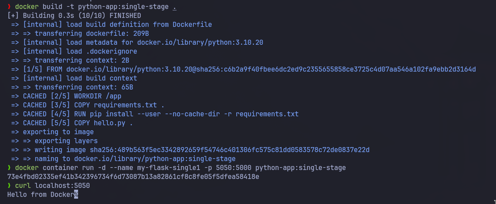
  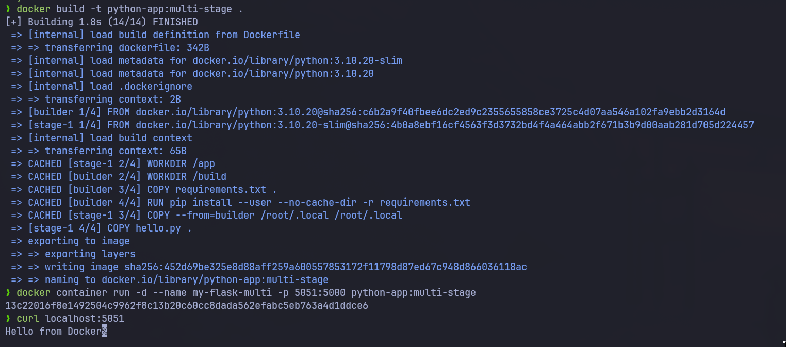

- notice the size difference
  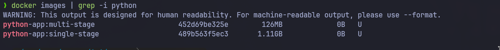

- rename the image and push it
  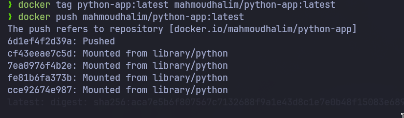

## Lab 02

<a id="lab-02"></a>
<a id="lab-02-problem-01"></a>

### Problem 01

- create 2 volumes
  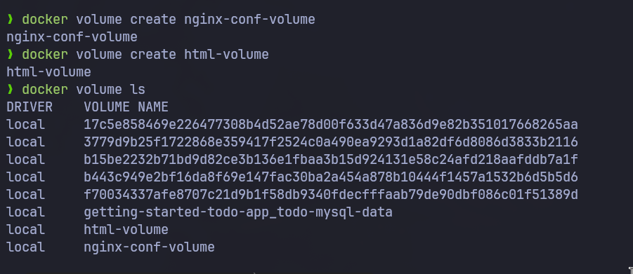

- create nginx container
  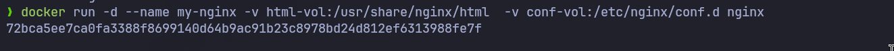

- edit html content
  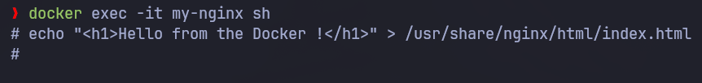

- remove the container

  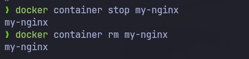

- create another two nginx containers and test if the html files persist
  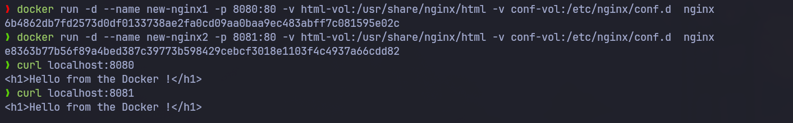

<a id="lab-02-problem-02"></a>

### Problem 02

- create nginx container with binding volume
  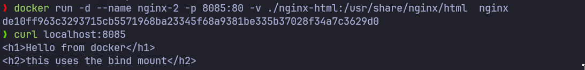

- removing the container and creating a new one will not remove the files
  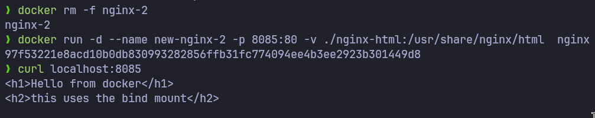

## Lab 03

### Problem 03

- create nginx container on network 1
  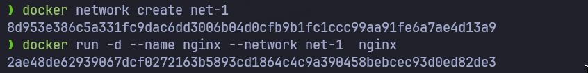
- create flask app on network 1 and network 2
  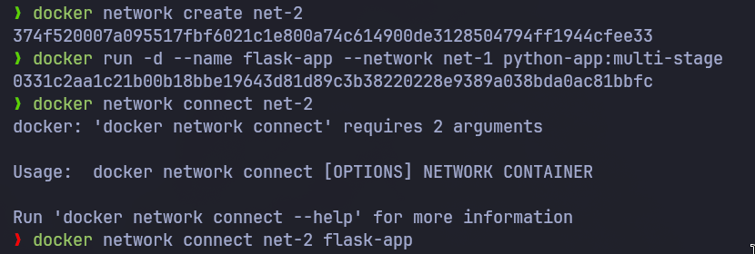
- run mariadb in network 2
  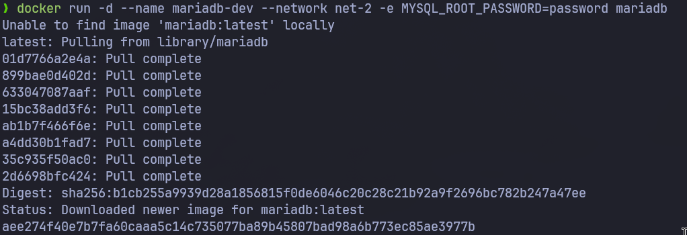
- since nginx and flask app in the same network the can ping each other using container name
  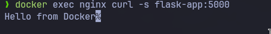

